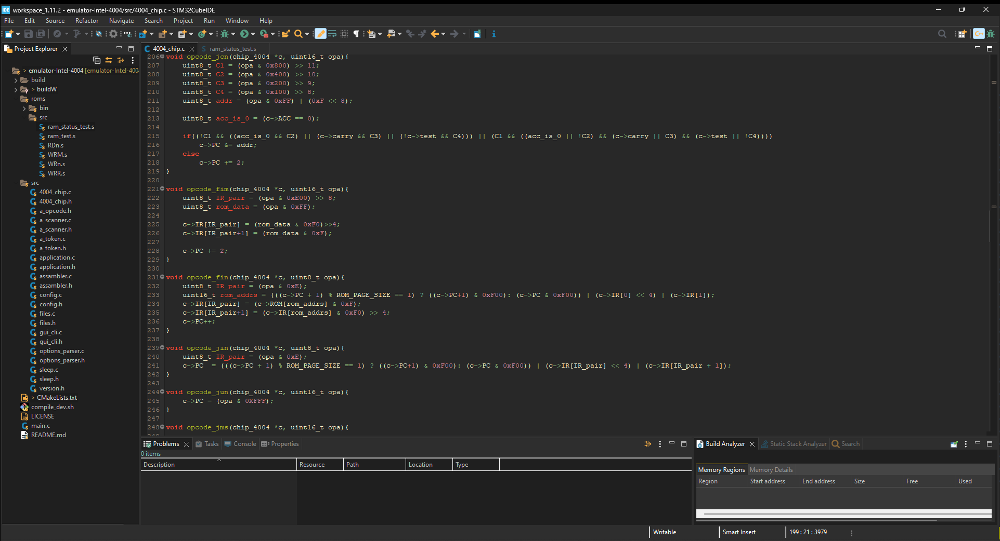
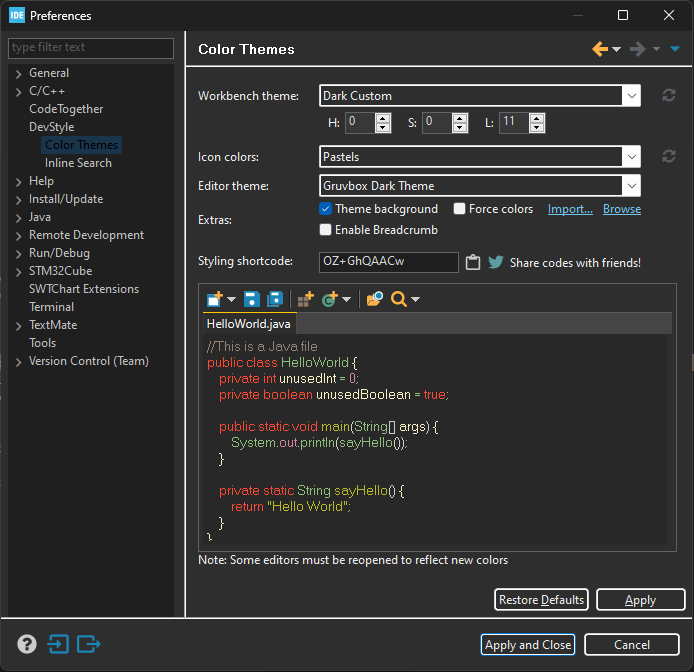

# Gruvbox for [Eclipse](https://www.eclipse.org/) based on
[morhetz/gruvbox](https://github.com/morhetz/gruvbox)

> A dark theme for [Eclipse](https://www.eclipse.org/).

Current version only have one dark theme. The `hard`, `medium` and `soft`
variants for dark and light themes need to be implemented.

Tested on:

- [STM32CubeIDE](https://www.st.com/en/development-tools/stm32cubeide.html)
- [DBeaver](https://dbeaver.io/)
- [Eclipse](https://www.eclipse.org/)

> On Java and others languages maybe have strange colors, only tested with C
and C++.

## Install

#### Prerequisites

- [Eclipse](https://www.eclipse.org/) IDE installed on your system.
- [Darkest Dark](https://marketplace.eclipse.org/content/darkest-dark-theme-devstyle)
plugin from the Eclipse Marketplace.

> When install Darkest Dark select the Icon Designer options to, for pastel
icons.

#### Activating theme

1. In Eclipse, to open the desired theme selection window go to
`Window > Preferences > DevStyle > Color Theme`.
2. In Extras section, click import and select `gruvbox-dark-theme.xml` from the
downloaded repository.
3. Select `Gruvbox Dark Theme` from the Editor theme dropdown.
4. Select `Dark Custom` from the Workbench Theme dropdown.
5. Check `Theme background` in Extras section.
6. Enter the HSL values of `HSL(0, 0, 11)` (equivilent of #282828 - background).
8. Select the `Pastels` from Icon Colors.
9. Click on `Apply and Close`.
10. Restart Eclipse.

> See Screenshot for clarifications below.

#### Touble shooting

- If the HSL selection menu does not appear for Window theme `Dark Custom`,
try restarting Eclipse and reopening the menu.

- If the [Darkest Dark](https://marketplace.eclipse.org/content/darkest-dark-theme-devstyle)
is not listed when on the plugins go to `Window > Preferences > Install/Update > Available Software Sites`,
click on `Add...` on name put `Darkest Dark Theme` and location [https://www.genuitec.com/updates/devstyle/ci/](https://www.genuitec.com/updates/devstyle/ci/).
And try install the plugin again.

## Contributing

See [CONTRIBUTING.md](./CONTRIBUTING.md) to instruction for help to project.

## License

[MIT License](./LICENSE)
